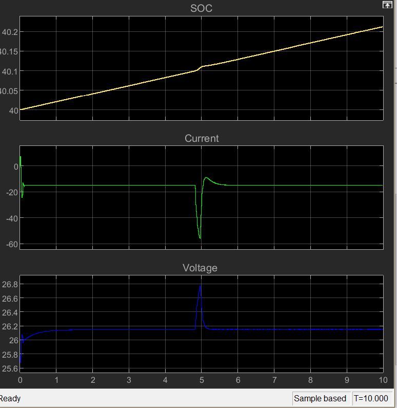

# 🔋 EV Battery Charging (CC-CV) Model in Simulink

## 📌 Overview

This project presents a MATLAB Simulink model for Electric Vehicle (EV) battery charging using the Constant Current–Constant Voltage (CC-CV) method.

## ⚙️ Charging Stages

* **CC Mode:** Constant current charging until voltage limit
* **CV Mode:** Constant voltage with decreasing current

## 🖼️ Simulation Results

## 🧠 Features

* CC-CV control implementation
* Lithium-ion battery model
* Smooth transition between charging modes
* Voltage & current analysis

## 🚗 Applications

* EV Battery Management Systems (BMS)
* Charging station design
* Renewable energy storage

## 🛠️ Tools

* MATLAB
* Simulink

## ▶️ How to Run

1. Open `EVchargerCVCC.slx`
2. Run simulation
3. Observe current & voltage

## 🎥 Tutorial

https://www.youtube.com/watch?v=zZ1ymTjzyBU

## 👩‍💻 Author

Marwa Abdelkareem
